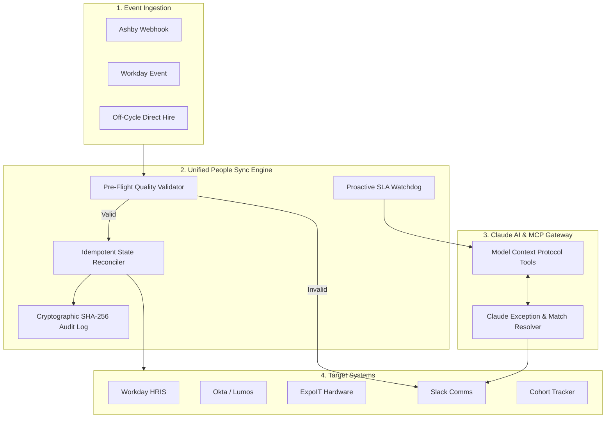

# BetterUp People Technology: Onboarding Sync & SLA Engine

[](https://www.python.org/)
[](https://fastapi.tiangolo.com/)
[](https://modelcontextprotocol.io/)
[](tests/)

> **Role**: AI Automation Engineer Take-Home Exercise  
> **Company**: BetterUp (People Technology)  
> **Author**: Engineering Candidate  
> **Date**: August 2026  

---

## 🎯 Executive Overview

BetterUp is hiring at high velocity. Onboarding a single hire requires keeping data and permissions synchronized across **Ashby (ATS)**, **Workday (HRIS)**, **Okta & Lumos (Identity/IGA)**, **ExpoIT (Hardware)**, **Slack**, and **Cohort Tracker**.

To solve post-offer data drift, unvalidated address errors, and unmonitored SLA lead times, we built the **Unified Change Propagation Engine with Pre-Flight Quality Validation and Proactive SLA Gatekeeping**.

---

## 🏛️ System Architecture & Data Flow



---

## 🔑 Key Engineering Highlights

1. **Canonical Data Model (`CandidateProfile`)**: Single unified domain schema resolving identity across Ashby Candidate IDs (`CAND-XXXX`), Workday Employee IDs (`WD-XXXXX`), Okta UPNs, and ExpoIT Order IDs.
2. **Deterministic Idempotency Protection**: Computes a deterministic MD5 hash key on incoming payload domain fields. Retries or duplicate webhooks return `SKIPPED_DUPLICATE` without side effects.
3. **Pre-Flight Quality Gate**: Traps invalid ZIP codes, missing street addresses, or past start dates BEFORE emitting mutations to Workday or shipping laptops.
4. **Proactive SLA Watchdog**: Monitors pending milestones ($T-7$ Hardware, $T-5$ Background Check, $T-3$ Okta). Triggers context-aware Claude AI escalations to hiring managers via Slack before deadlines breach.
5. **Cryptographic SHA-256 Audit Trail**: Blockchain-style append-only ledger (`Hash_n = SHA256(Hash_{n-1} + Timestamp + Event + Changes)`) with automated integrity checking.
6. **Model Context Protocol (MCP) Server**: Full FastMCP server exposing tools for Claude Code / agentic workflows.

---

## 📂 Deliverables & Repository Structure

- 📘 **[system_map.md](system_map.md)**: Deliverable 1 - Systems Map, Failure Mode Matrix, Slice Selection Justification & Tooling Constraint Defense.
- 📝 **[build_note.md](build_note.md)**: Deliverable 3 - Build Note detailing key design choices, productionization roadmap, AI tools used, and AI failure case study.
- ⚙️ **`src/`**: Python backend package (`models/`, `mock_adapters/`, `core/`, `ai/`, `api/`).
- 💻 **`web/`**: Glassmorphic Executive Dashboard Control Center.
- 🧪 **`tests/`**: Pytest automated unit and end-to-end integration test suite.
- 🚀 **`scripts/run_demo.py`**: CLI interactive simulation walkthrough.

---

## ⚡ Quickstart & How to Run

### 1. Install Dependencies
```bash
pip install -r requirements.txt
```

### 2. Run Automated Pytest Suite (100% Pass Rate)
```bash
PYTHONPATH=. pytest tests/
```

### 3. Run Interactive CLI Walkthrough
```bash
python3 scripts/run_demo.py
```

### 4. Launch Visual Web Dashboard
```bash
uvicorn src.api.main:app --host 0.0.0.0 --port 8000
```
Open `http://localhost:8000/dashboard/index.html` in your browser.

---

## 🔌 Model Context Protocol (MCP) Tools

| MCP Tool Name | Description |
| :--- | :--- |
| `reconcile_candidate_change` | Idempotently reconciles candidate state across all 6 downstream systems. |
| `validate_onboarding_data` | Runs pre-flight quality check on candidate JSON. |
| `get_sla_exceptions` | Scans all candidate records for pending onboarding SLA deadline breaches. |
| `ai_resolve_record_discrepancy` | Leverages Claude AI to compare conflicting Ashby & Workday records. |
| `get_audit_trail_integrity` | Verifies cryptographic SHA-256 hash chain integrity of the audit ledger. |
