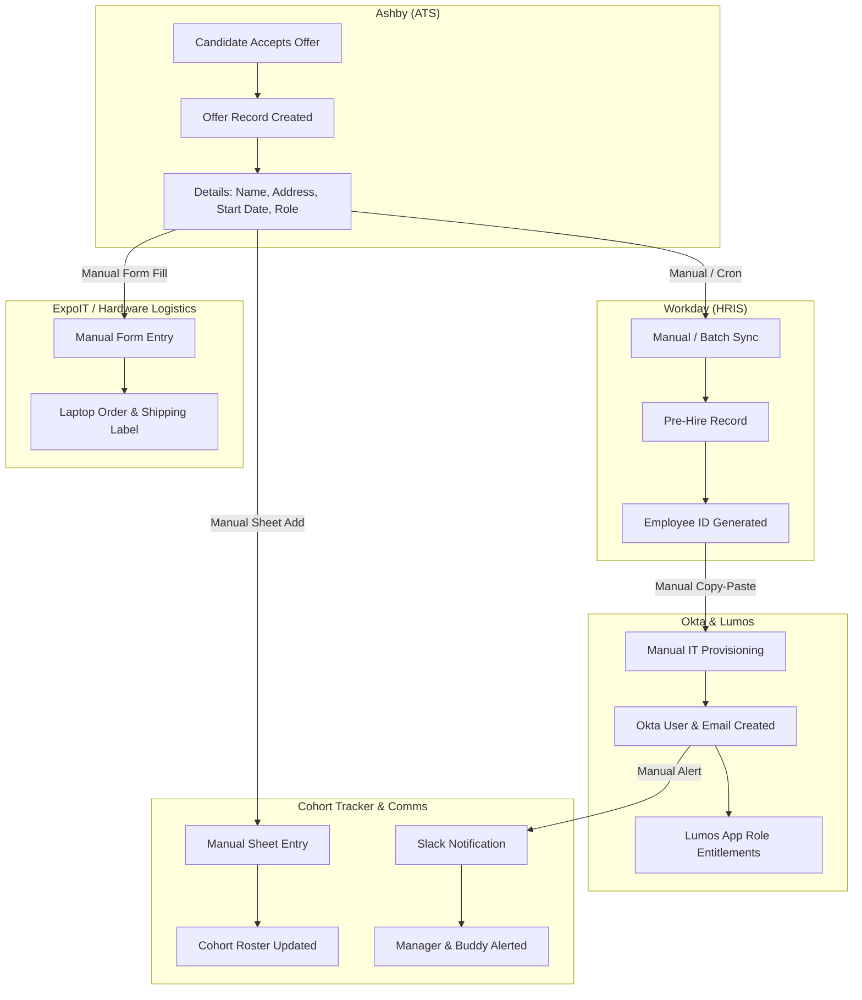
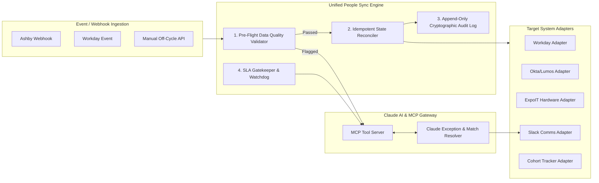

# BetterUp People Technology Systems Map & Architecture Strategy

> **Role**: AI Automation Engineer Take-Home Exercise  
> **Author**: Engineering Candidate  
> **Date**: August 2026  
> **Deliverable**: Systems Map, Failure Mode Analysis, and Strategic Slice Selection  

---

## 1. Executive Summary & Context

BetterUp is experiencing rapid hiring growth. Onboarding a single team member requires orchestrating data and permissions across six distinct systems: **Ashby (ATS)**, **Workday (HRIS)**, **Okta & Lumos (Identity & Governance)**, **ExpoIT (Equipment/Hardware Logistics)**, **Slack / Google Workspace (Communication & Productivity)**, and a **Cohort Tracker (Operations)**.

Currently, this cross-system coordination relies on manual hand-offs and point-to-point scripts. This document presents a comprehensive systems map of the onboarding landscape, diagnoses current system failure modes, defines our strategic choice of the highest-leverage engineering slice, and outlines the target architecture powering our working prototype.

---

## 2. As-Is Systems Landscape & Data Flow Matrix

Below is the current end-to-end data flow from candidate offer acceptance to Day 1 onboarding:

### System Responsibilities & Primary Data Owned

| System | Role in Onboarding | Primary Data Owned | Upstream Sources | Downstream Consumers |
| :--- | :--- | :--- | :--- | :--- |
| **Ashby** | Applicant Tracking System (ATS) | Candidate Profile, Signed Offer, Start Date, Personal Email, Address | Recruiter / Candidate | Workday, ExpoIT |
| **Workday** | System of Record (HRIS) | Employee ID, Legal Name, Tax Location, Compensation, Cost Center | Ashby | Okta/Lumos, Cohort Tracker |
| **Okta / Lumos** | Identity & Access Governance (IdP/IGA) | Corporate Email (@betterup.co), SSO Identity, Role-based App Access | Workday | Google Workspace, Slack |
| **ExpoIT** | Hardware Logistics & IT Fulfillment | Laptop Tier, Serial Number, Delivery Tracking, Shipping Address | Ashby / Hiring Form | Employee (Home Address) |
| **Slack / GSuite** | Comms & Workspaces | Welcome Messages, Manager Briefings, Onboarding Channel | Okta | Hiring Manager, Onboarding Buddy |
| **Cohort Tracker**| Operational Onboarding Dashboard | Start Date Cohort, Orientation Status, SLA Milestones | All Systems | People Ops Team |

---

## 3. Failure Vectors & Breakage Analysis

Why does the current manual and point-to-point process break? We identified **4 primary architectural failure vectors**:

```mermaid
graph TD
    subgraph FV1["Failure Vector 1: Post-Offer Change Propagation Drift"]
        F1A["Candidate pushes start date by 2 weeks in Ashby"] --> F1B["Workday start date remains unchanged"]
        F1B --> F1C["Okta activates account 2 weeks early"]
        F1C --> F1D["Laptop delivered to empty office/old date"]
    end

    subgraph FV2["Failure Vector 2: Off-Cycle Hire Blind Spots"]
        F2A["Executive / Contractor created directly in Workday"] --> F2B["No Ashby record exists"]
        F2B --> F2C["Bypasses ExpoIT & Cohort Tracker completely"]
    end

    subgraph FV3["Failure Vector 3: Bad Data Cascades"]
        F3A["Typo in Ashby address: 'Apt 4B' missing, ZIP invalid"] --> F3B["Flows straight to ExpoIT shipping API"]
        F3B --> F3C["FedEx delivery fails 2 days before Start Date"]
    end

    subgraph FV4["Failure Vector 4: Unmonitored SLA Gate Breaches"]
        F4A["IT Hardware form submitted < 3 days before start"] --> F4B["Standard 7-day hardware SLA breached"]
        F4B --> F4C["Day 1 hire has no laptop; manual fire-fighting"]
    end
```

---

## 4. Slice Selection & Strategic Engineering Rationale

We are asked to pick the highest-leverage slice among:
1. **Change Propagation**
2. **Cross-System Data Validation**
3. **Exception Monitoring**

### Our Selection: **Unified Change Propagation Engine with Integrated Pre-Flight Validation and SLA Gatekeeping**

#### Why This Slice Over Single-Purpose Alternatives?

| Slice Option | Impact | Downside if Built in Isolation |
| :--- | :--- | :--- |
| *Validation Only* | Catches address typos and missing fields | Cannot propagate start date updates or fix off-cycle hires when changes occur post-offer. |
| *Monitoring Only* | Alerts when hardware is late | Leaves People Ops to manually fix 5 different downstream systems under pressure. |
| **Unified Reconciliation & SLA Engine (Chosen)** | **Solves root-cause sync, blocks bad data pre-flight, and proactively monitors deadlines with AI escalation.** | Requires robust multi-system idempotency & canonical data modeling (which we engineered). |

### The Leverage Argument
By building an **Idempotent Reconciliation Engine** that incorporates **Pre-Flight Validation** and an **SLA Watchdog**, we address all three problem areas with one unified architecture:
- **Change Propagation**: Diffs target system states against the canonical model and issues deterministic, idempotent patch updates.
- **Data Validation**: Runs as the pre-flight gate before any mutation is applied to Workday, Okta, or ExpoIT.
- **Exception Watchdog**: Scans pending milestones against T-minus deadlines (7-day hardware lead time, background check clearance) and uses **Claude (via Model Context Protocol)** to intelligently draft fix instructions and resolve discrepancies.

---

## 5. Target State Architecture

---

## 6. Tooling & Platform Choices (Constraint Defense)

Per the constraint: *"Build with the tools we already have... If you truly believe a new tool is needed, name it and make the case."*

### Tools Leveraged:
- **Python / FastAPI**: Core lightweight backend execution layer (matching standard n8n / custom worker environments).
- **Claude & Model Context Protocol (MCP)**: Used as a precise agentic component for entity matching, data sanitization, and context-rich Slack escalation drafting—not as a black-box replacement for core deterministic business logic.
- **Slack / Webhooks**: Built-in alerting channel without introducing expensive third-party paging platforms.

### Tools Explicitly NOT Added (and Why):
1. **No new Enterprise iPaaS (e.g. Workato / MuleSoft)**: Our existing n8n, Zapier, and Python micro-services are more than sufficient when backed by an idempotent state machine. Adding Workato introduces $50k+ annual licensing without fixing underlying data governance.
2. **No Heavy Distributed Workflow Engine (e.g. Temporal)**: For onboarding syncs across 6 systems with low-latency requirement (< 10,000 hires/yr), lightweight Python async tasks with append-only audit persistence provide full reliability without Temporal cluster overhead.
